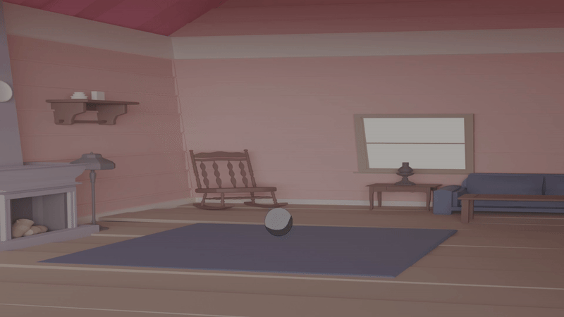

# **A showcase of 3D design learnings**

## 🤖 Gripper Project

A 3D mechanical gripper design with animated demonstrations. 

  
  
<i>Animated gripper mechanism in action</i>

---

### 📸 Additional Views

  

---

### 📦 Project Files
- **Design Files**: Available in `gripper/Gripper.zip`
- **Made using**: <a href="https://www.onshape.com/en/">Onshape</a>

---

## ⚽ Ball Bounce Animation

  
  
<i>Ball Bouncing Animation in Blender</i>

---
